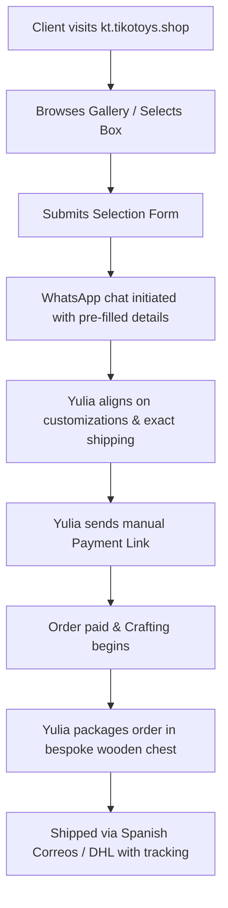

# KT.TikoToys Business Strategy & Operational Manual

This document outlines the cross-functional strategy for **KT.TikoToys** (`kt.tikotoys.shop`), combining Business Architecture, Marketing Strategy, Product Management, and Operational Workflows to drive high-value custom orders for Yulia.

---

## 🏛️ 1. Business Architecture

### Value Proposition
KT.TikoToys is a luxury handcrafted amigurumi brand, offering individual collector toys and premium curated gift boxes.
- **Crafted with Love**: Every toy is hand-knitted by Yulia.
- **Safety First**: Made with premium, hypoallergenic chenille and cotton yarns, with safety-locked eyes.
- **Bespoke Customization**: Clients can choose colors, themes, and personalized engravings.
- **Spain to Worldwide**: Based in San Pedro Alcántara (Marbella), Malaga, Spain, shipping worldwide with express delivery.

### Lead-Generation Flow
To avoid transactional complexities and shipping logistics for custom craft, the system uses a **Bespoke Inquiry Selection Flow**:
1. **Browse**: User views toys and gift boxes.
2. **Select**: Adds items of interest to their "Inquiry Selection" list.
3. **Form**: Enters name, WhatsApp number, email, and shipping address.
4. **WhatsApp Handshake**: Submitting generates a pre-formatted WhatsApp text containing the selected products, total estimated value, and shipping info, and opens a direct chat with Yulia.
5. **Close Deal**: Yulia reviews the list, discusses custom requests (colors, characters), calculates exact shipping from Spain, and provides a manual invoice link (Paddle, Revolut, bank transfer, etc.).

---

## 📣 2. Marketing & Positioning Strategy

To capture premium buyers (€500 - €1000 box sets), we target parents looking for unique nursery toys, and high-end gift shoppers.

### TikTok & Instagram Hook Strategy
Yulia's content should focus on **Process, Aesthetics, and Packaging** to create a "wow-effect" and viral potential:
1. **"Pack an Order with Me" Reels**: Record Yulia carefully putting toys into the customized wooden gift chests, wrapping them in silk paper, and writing a calligraphy card. This builds high trust and justifies the €500+ price tag.
2. **Timelapse Crochet**: Show the hours of work condensed into 15 seconds. Headline: *"12 hours of loops, 1 minute of joy."*
3. **Behind the Scenes**: Yulia's workshop in San Pedro Alcántara, surrounded by colorful yarn, overlooking sunny Marbella.
4. **Customer Reactions**: Share text reviews and videos of children unboxing their custom toy chests.

### Local & Global SEO Optimization
- **Google Maps Listing**: Create a Google Business Profile for *KT.TikoToys* at C. las Gitanillas, 14, Marbella, Málaga, Spain. List under "Handicraft Shop" or "Toy Store".
- **Local SEO**: Target Marbella, Malaga, and Costa del Sol tourists and expats who seek premium local gifts.
- **Global Search phrases**: Optimize pages for keywords: *"luxury handmade toys Spain"*, *"custom knitted toy box"*, *"bespoke amigurumi Marbella"*, *"premium baby shower gifts Malaga"*.
- **Structured Data**: The site utilizes `Schema.org/LocalBusiness` microdata to signal its location and pricing tiers directly to Google Search.

---

## 📦 3. Operational Workflow

### Order Fulfillment Checklist
1. **Consultation**: Reply to WhatsApp inquiries with warm, friendly greetings. Confirm color palettes, custom details, and shipping address.
2. **Invoicing**: Generate payment request (Paddle/Stripe/Revolut) with itemized list and confirmed shipping rates.
3. **Crafting**: Keep the customer updated by sending 1-2 photos during the toy crochet process. This increases customer delight.
4. **Bespoke Packaging**:
   - For Box Orders: engrave client name on the wooden chest, line with silk paper, add calligraphy thank-you note.
   - For Individual Toys: wrap in custom linen bags with a gift tag.
5. **Shipping**: Ship within Spain (standard 24-48h) or internationally (DHL/UPS/Correos Express). Send tracking link directly in the WhatsApp thread.
